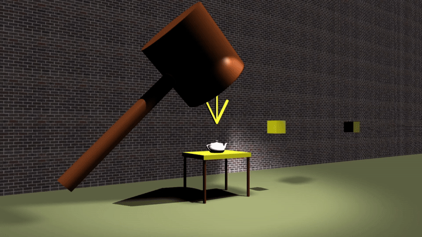

# 3D Radial Blur Demo



A real-time radial blur / post-processing effect implemented with Three.js and WebGL.

## Features
- Radial blur post-processing effect
- Adjustable blur intensity
- Real-time rendering in browser
- Shader-based screen-space sampling

## Technologies
- Three.js
- WebGL
- GLSL
- JavaScript

## Demo
https://illiand.github.io/Radial-Blur/mainS.html

### Control

```
w: move forward
s: move back
a: rotate camera left
d: rotate camera right
q: move left
e: move right
r: move camera up
f: move camera down

p: start/end permanent blur
b: blur at a time
o: reset the camera

1/2: increase/decrease blur attenuation
3/4: increase/decrease blur radius
Keypad (without NumLock): 2, 4-9 : move blur center world position
```

### Demo Example

```
g: set the hammer
G: start the hammer
l: remove the hammer
```
